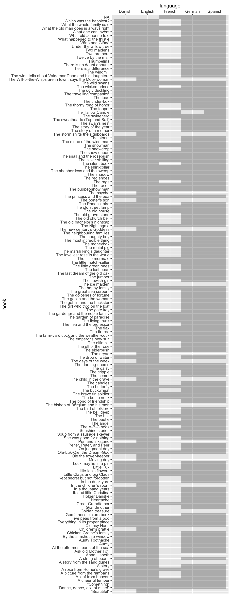

hcandersenr 
=========================================================================

[](https://travis-ci.org/EmilHvitfeldt/hcandersenr)

An R Package for H.C. Andersens fairy tales
-------------------------------------------

This package contains (most) the complete texts of 157 fairy tales of H.C. Andersen, in a number of different languages. formatted to be convenient for text analysis. Where each text is formatted to elements of about 80 characters. The package contains:

-   `hcandersen_da`: 139 out of the 157 Fairy tales in Danish
-   `hcandersen_de`: 156 out of the 157 Fairy tales in German
-   `hcandersen_en`: 157 out of the 157 Fairy tales in English
-   `hcandersen_es`: 157 out of the 157 Fairy tales in Spanish
-   `hcandersen_fr`: 61 out of the 157 Fairy tales in French
-   `EK`: dataframe with ID, names and publishing dates
-   `hca_fairytales`: Complete collection of all fairytales in this package

Avaliable fairytales
--------------------

``` r
library(hcandersenr)
library(tidyverse)
hca_fairytales %>% 
  select(book, language) %>% 
  unique() %>% 
  ggplot(aes(language, book)) + 
  geom_raster(alpha = 0.3) +
  scale_x_discrete(position = "top")
```



Installation
------------

To install the development version from Github:

``` r
library(devtools)
install_github("EmilHvitfeldt/hcandersenr")
library(hcandersenr)
```
